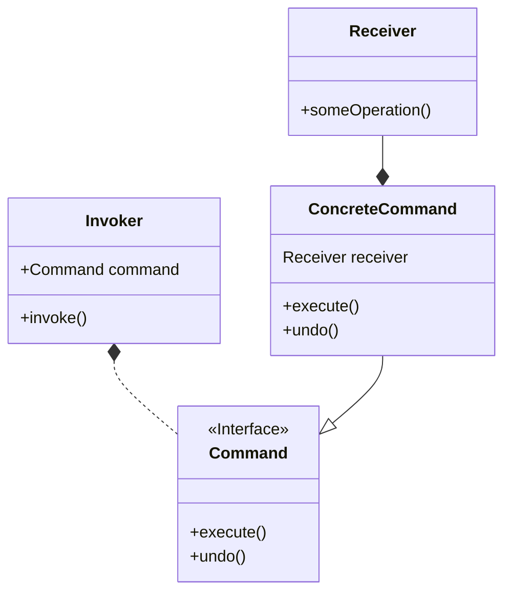

## 命令模式

### 定义

命令模式将"请求"封装成（命令）对象，_以便使用不同的请求、队列或者日志来参数化其他对象_。
命令模式也支持**撤销**的操作。

> 命令模式是一种行为设计模式，它可将请求转换为一个包含与请求相关的所有信息的独立对象。 
该转换让你能根据不同的请求将方法参数化、延迟请求执行或将其放入队列中，且能实现可撤销操作。

### 设计原则

1. 解耦：命令模式使*发起者和接收者解耦*。发起者不关心具体的接收者，只需要根据已知的命令对象
执行`execute()`方法即可。

### UML简图

### 要点
1. 命令模式将发出请求的对象（调用者）和接收请求的对象（接收者）解耦。
2. 被解耦的对象之间通过命令对象沟通，命令对象封装了接收者和一个或者一组动作。
3. 调用者通过执行命令对象的`execute()`方法发出请求，这会使得接收者的动作被调用。
4. 调用者接收命令作为参数。甚至可以在运行时动态地进行。
5. 命令支持撤销。
6. 宏命令是命令的简单延伸，允许一次调用多个命令。宏命令也支持撤销。
7. [命令也可以用来实现日志和事务系统。]
