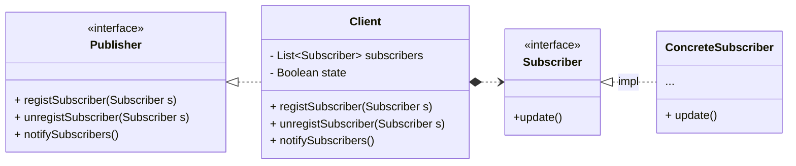

### 定义

- by Head First 设计模式
  > 在对象之间建立一对多的依赖，这样一来，当一个对象的状态改变，依赖它的对象都会收到通知，并且自动更新。
- by Dive into Design Patterns:
  > *Also Known as: Event-Subscriber, Listener*
  > 
  > Observer is a behavioral design pattern that lets you define a *subscription mechanism*
    to notify multiple objects about any events that happen to the object they’re observing.

### 设计原则
1. 找出应用之中可以变化之处，把它们独立出来，不要和那些不需要变化的代码混在一起
2. 针对接口编程，而不是针对实现编程
3. 多用组合，少用继承
4. 为交互对象的*松耦合*设计而努力
  - 事实上，不用设计模式也可以硬编码出发布者-订阅者工作模式的代码，只不过发布者与订阅者呆在一起，会比较臃肿😮，
    也不利于扩展。
  - 在观察者模式中，被观察者（发布者）与观察者（订阅者）是松耦合的，发布者并不关心订阅者的具体细节，只需要知道
    其订阅与否，就知道状态变化后是否对其发送通知；同样地，订阅者也不关心发布者如何通知它，只需要处理好自己收到
    通知的业务就行了😊
  - 松耦合的设计优势得以体现：代码有层次感，易于拓展和维护。

> 想想看MVC开发模式，这是不是松耦合的设计呢？控制层、模型层、视图层分别有自己的业务范围

### UML简图

### 笔记
1. 观察者模式定义了对象之间一对多的关系。
2. 发布者（被观察者）用一个统一的接口来更新观察者。
3. 发布者和订阅者之间使用*松耦合*（*loosecoupling*）的方式结合，订阅者不知道观察者的细节，只知道观察者实现观察者接口。
4. 使用此模式时，订阅者可以从发布者处"推"或者"拉"数据， 不过"推"一般被认为是正确的方式。
5. 有多个订阅者时，可以不依赖特性的通知顺序。
6. Java提供了此模式的包，包括`java.util.Observable`（*Deprecated since Java 9*）。
7. 此模式被用在其他地方，如JavaBeans，RMI。

