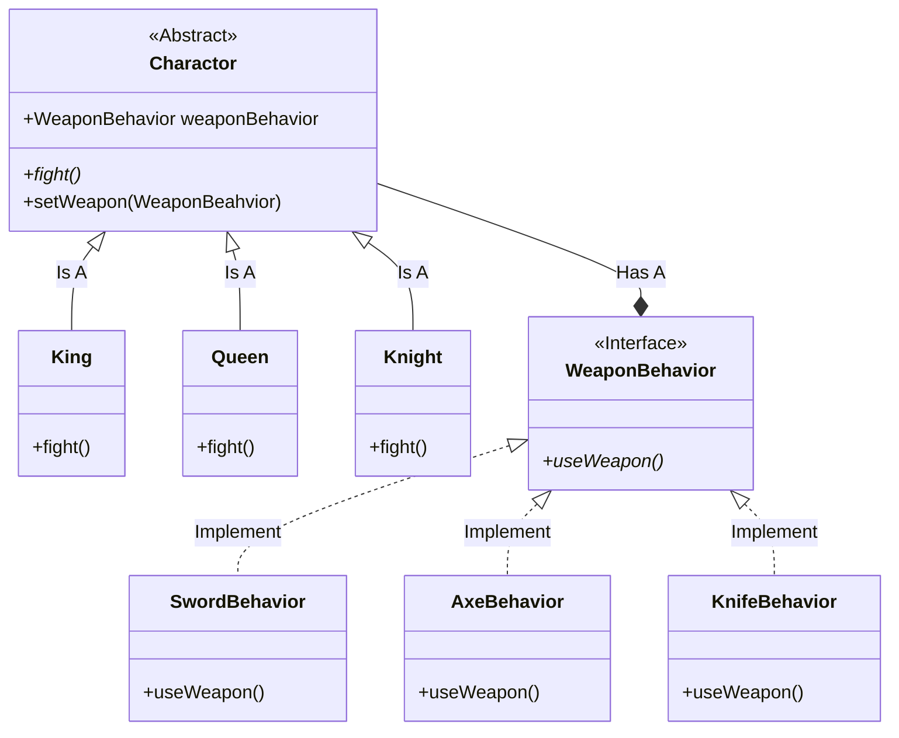

## 策略模式

### 定义

- by Head First 设计模式:
    > 策略模式定义了算法族，分别封装起来，让他们之间可以互相替换。此模式让算法的**变化**独立于使用算法的"客户"。

- by Dive into Design Patterns:
    > **Strategy** is a behavioral design pattern that lets you define a family of algorithms,
  > put each of them into a separate class, and make their objects interchangeable.

### 设计原则

1. 找出应用之中可以变化之处，把它们独立出来，不要和那些不需要变化的代码混在一起
2. 针对接口编程，而不是针对实现编程 
   - 客户的行为可以抽象为接口的，不必让客户去实现接口。如果这样做，客户想改变行为需要不断地去编写
   实现。这样的行为，可以理解为针对实现编程。
   - 鉴于此，可以在别处实现接口，客户只需要根据接口来选择合适的行为，这样做客户的代码更简洁且便于
   维护。
3. 多用组合，少用继承
   - 将两（多）个类组合起来使用，就是组合（*composition*），这样比使用继承好的一点是：系统的弹性
   更大，并且可以避免使用继承不得不出现的无意义重写（*override*）一些需要规避掉的方法。

### UML简图

