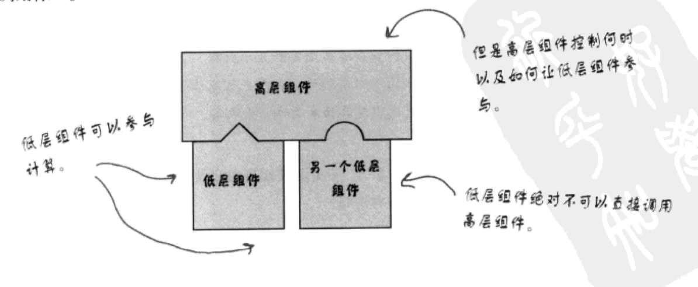
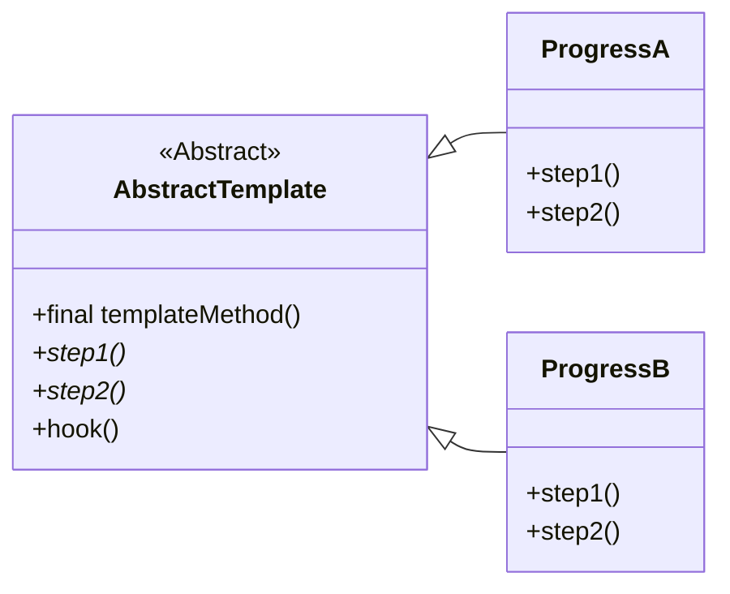

## 模板方法模式

### 定义

模板方法模式在一个方法中定义一个算法的骨架，而将一些步骤
延迟到子类中。模板方法可以使得子类在不改变算法结构的前提
下，重新 定义算法的某些步骤。

### 开发原则

- 针对接口编程，而不是针对实现编程
- 多用组合，少用继承
- 为交互对象之间的松耦合而努力
- 类应该对拓展开放，而对修改关闭 （开放-关闭原则）
- 依赖抽象，而不依赖具体类 （依赖倒置原则）
- "最少知识原则"——只和你的朋友交谈，不要让太多的类耦合在一起
- "好莱坞原则"——别调用我们，我们会调用你

#### 好莱坞原则：定义
好莱坞原则定义了一种防止"依赖腐败"的方法。当高层组件依赖底层组件时，
而低层组件又依赖高层组件，而高层组件又依赖边侧组件，边侧组件又
依赖低层组件时，依赖腐败就发生了。

> 简而言之，好莱坞原则希望系统设计能规避环行依赖。

在好莱坞原则上，高层组件依赖低层组件（违反依赖倒置原则），但是
高层组件决定什么时候如何使用低层组件，而低层组件不允许调用
高层组件。

#### 好莱坞原则：和模板方法的关系

模板方法运用了好莱坞原则，模板方法需要子类来实现具体细节。只有在需要
子类来实现细节时，才会调用子类的方法。而子类如果没有主动调用，绝对
不会调用抽象类。

> 工厂方法，观察者模式也运用了好莱坞模式。

### 在模板方法中使用钩子（Hook）

在模板方法中，还有一种特殊的运用——钩子。利用钩子，可以使子类实现
细节的策略更加灵活。

钩子利用在模板内实现，是否覆盖由子类决定。

### UML简图

### 要点
- 模板方法定义了算法的步骤，并且把步骤的实现延迟到子类。
- 利用模板方法，代码可以很好的复用。
- 模板方法的抽象类可以定义具体方法，抽象方法和钩子。
- 钩子是一种方法，它在模板方法中不做事，或者只做默认的事情。
- 模板方法可以声明为`final`，以防止子类篡改算法逻辑。
- 好莱坞原则允许高层组件依赖低层组件，但是低层组件不能调用
高层组件的方法，必须由高层组件决定何时、如何调用。
- 策略模式和模板方法都是封装算法，前者使用组合，后者使用继承。
- *工厂方法是模板方法的特殊版本。*

### 话外