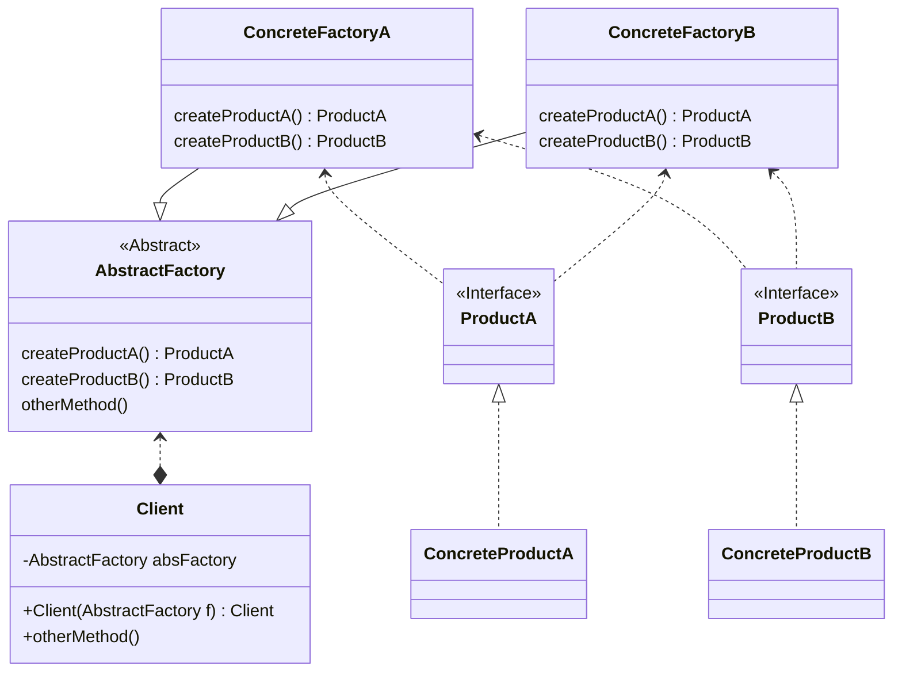

### 抽象工厂模式

#### 定义
- by Head First 设计模式
  > 抽象工厂模式提供了一个接口，用于创建相关或依赖对象的家族，而不需要指定具体类。
  > 简而言之，抽象工厂可以创建一群对象，而不单单只创建一种对象。

- by Dive into Design Patterns
  > **Abstract Factory** is a creational design pattern that lets you 
  > produce families of related objects without specifying their 
  > concrete classes.

#### 与工厂模式的区别

- 所有的工厂都是用**封装**来创建对象。
- 工厂方法使用继承：把对象的创建委托给子类，子类实现工厂方法来创建对象。
- 抽象工厂使用对象组合：对象的创建被实现在工厂接口所暴露的方法中。
- 所有工厂模式通过减少应用程序和具体类之间的依赖，而促进松耦合。
- 工厂方法允许将类的实例化延迟到子类进行。
- 抽象工厂创建相关的对象家族，而不需要依赖它的具体类。

#### UML简图

#### 设计原则

- 针对接口编程，而不是针对实现编程
- 多用组合，少用继承
- 为交互对象之间的松耦合而努力
- 类应该对拓展开放，而对修改关闭 （开放-关闭原则）
- 依赖抽象，而不依赖具体类 （依赖倒置原则）