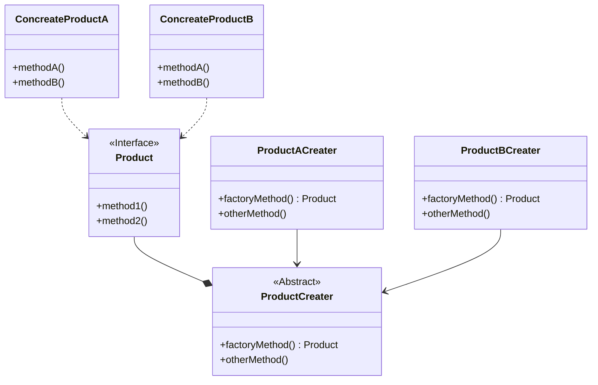

### 工厂模式

#### 定义

- by Head First 设计模式
  > 工厂方法模式定义了一个创建对象的接口，但是由子类决定要创建的对象是哪一个。工厂方法把类的实例化推迟到
  > 子类。 

- by Dive into Design Patterns
  > **Factory Method** is a creational design pattern that provides an interface for creating
  > objects in a superclass, but allows subclasses to alter the type of objects that will be 
  > created.

#### 设计原则

工厂方法很简单，实际上就是抽取客户中实例化对象的代码，利用"对象工厂"来进行实例化。这样做有几个明显的好处：
1. 降低耦合：创建对象的过程和具体的业务解耦。
2. 基本上满足开-闭原则：如果使用工厂，创建对象的逻辑变动或者所需要创建对象变动对客户的代码影响不大。
3. 满足**依赖倒置原则**：
   - 依赖抽象而不是依赖具体实现类。不管是高层组件（接口）还是低层组件（对象），都应该依赖抽象。
      高层组件不应该直接依赖具体的对象。
   - [依赖倒置原则-维基百科](https://zh.wikipedia.org/zh-cn/%E4%BE%9D%E8%B5%96%E5%8F%8D%E8%BD%AC%E5%8E%9F%E5%88%99)

#### UML简图

#### 开发建议

[《深入设计模式》中关于工厂模式的介绍](https://refactoringguru.cn/design-patterns/factory-method)
