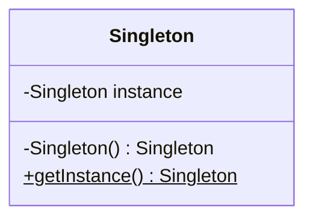

### 单例模式

#### 定义

- by Head First 设计模式
  > 单例模式确保一个类只有一个实例，并且提供一个全局访问点。

- by Dive into Design Patterns
  > **Singleton** is a *creational design pattern* that lets you ensure
  > that a class has only one instance, while providing a global
  > access point to this instance.

#### 模式特点

- 单例模式确保程序中一个类**只有**一个实例。
- 单例模式提供类的全局访问点。
- Java实现单例需要私有构造器、静态方法和静态变量。
- 确定在性能和资源上的限制，再采用合适的方法来实现单例模式，以确保在多线程下的安全性。
- [ ] 如果使用多个类加载器，可能导致单例模式失效而出现多个实例。[例证？]

#### UML简图



#### 实现

##### 1. 典型但线程不安全实现

```java
public class Singleton {
    private static Singleton INSTANCE = null;

    private Singleton() {
    }

    public static Singleton getInstance() {
        if (INSTANCE == null) {
            INSTANCE = new Singleton();
        }
        return INSTANCE;
    }
}
```

典型的单例实现，但多线程下不适用。

##### 2. 提前实例化

```java
public class Singleton {
    private static final Singleton INSTANCE = new Singleton();

    private Singleton() {
    }

    public static Singleton getInstance() {
        return INSTANCE;
    }
}
```

它是线程安全的，因为静态变量只在类初始化时初始化。它只有一个缺点：如果是资源紧张
的情况，提前实例化有一点点的资源浪费（如果用不到的话）。

##### 3. 使用同步方法（重量级锁）

对方法1的改进：

```java
public class Singleton {
    private static Singleton INSTANCE = null;

    private Singleton() {
    }

    public synchronized static Singleton getInstance() {
        if (INSTANCE == null) {
            INSTANCE = new Singleton();
        }
        return INSTANCE;
    }
}
```

此方法是可行的。但是，它存在很严重的性能浪费，使用`synchronized`对方法加锁，
可能导致代码执行效率低1000倍！

##### 4. 使用DCL (Double-Check-Locking)

对方法3的改进。既然不推荐使用重量级锁，那么是否有更好的加锁方式呢？

```java
public class Singleton {
    private volatile static Singleton INSTANCE = null;

    private Singleton() {
    }

    public static Singleton getInstance() {
        if (INSTANCE == null) {
            synchronized (Singleton.class) {
                if (INSTANCE == null) {
                    INSTANCE = new Singleton();
                }
            }
        }
        return INSTANCE;
    }
}
```

DCL中使用了`volatile`关键字，这是必须的。第一次的`null`判定减少了上锁的
概率，第二次的`null`判定才是保证线程安全根本。

注意，这个方式并不一定是百分百安全的，`volatile`关键字的语义在1.4版本之前
的Java中存在bug。

> One thing to keep in mind with this pattern is that the field
> needs to be *volatile* to prevent cache incoherence issues.
> In fact, the Java memory model allows the publication of
> partially initialized objects and this may lead in turn to
> subtle bugs.

##### 5. 延迟实例化（按需加载）
对方法2的小小优化。

```java
public class Singleton {
    private static class InstanceHolder {
        private static final Singleton INSTANCE = new Singleton();
    }

    private Singleton() {
    }
    
    public static Singleton getInstance() {
        return InstanceHolder.INSTANCE;
    }
}
```
与方法2的区别是，单例对象只有在调用`getInstance()`方法时，才会初始化。

##### 6. 使用枚举
枚举类只有指定的实例，并没有其他办法来创建其他实例，因此可以用来实现单例。

```java
public enum Singleton {
    INSTANCE("unique");
    
    private String abbr;
    
    private Singleton(String abbr) {
      this.abbr = abbr;
    }
}
```

#### 讨论
单例模式是一个简单的设计模式，但是可别滥用它。使用时想一想，是否一定需要
一个单例对象，才能满足需求？

单例模式实际上违法了**单一职责原则**：单例保证了实例的唯一性，同时还要提供
全局访问入口。

同时，单例代码使得测试工作变得麻烦。

上文提及的单例模式创建方法，实际上只有`early initializatin`和
`lazy initialization`两种，使用DCL可能会由于编译器优化存在细微的问题，
而枚举类单例的形式，是[*Effective Java*]中推荐使用的。

> 不管怎样，使用枚举来实现复杂的单例，看起来很怪。

另外，使用单例可能还会有其他一些问题：

1. 如果是在分布式环境中，基于JVM唯一的单例如何保证？
2. 注意你的类加载器，不同的类加载器可能会导致多例。
3. 要防止单例对象被回收。


#### 参考

1. [Medium: 5 ways to write singleton](https://sinethneranjana.medium.com/5-ways-to-write-a-singleton-and-why-you-shouldnt-1cf078562376)
2. [Baeldung：Singletons in Java](https://www.baeldung.com/java-singleton)
3. [Baeldung: Double-Check-Locking with singleton](https://www.baeldung.com/java-singleton-double-checked-locking)