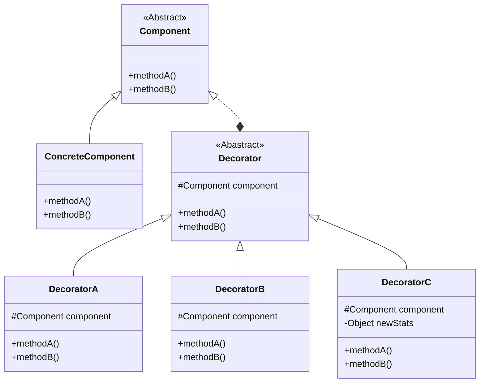

## 装饰者模式

### 定义

- by Head First 设计模式:
  > 动态地将责任附加到对象上。若要拓展功能，装饰者模式提供了比继承更有弹性的替代方案。

- by Dive into Design Patterns:
  > Also known as *Wrapper*
  > 
  > Decorator is a structural design pattern that lets you attach new behaviors
    to objects by placing these objects inside special wrapper objects that 
    contain the behaviors.

### 设计原则
1. 找出应用之中可以变化之处，把它们独立出来，不要和那些不需要变化的代码混在一起
2. 针对接口编程，而不是针对实现编程
3. 多用组合，少用继承
4. 为交互对象的*松耦合*设计而努力
5. 对象应对拓展开放，而对修改关闭（开闭原则）
   - 听起来很矛盾，但是确实有一些OO技巧，允许系统在不修改代码的情况下，进行功能拓展（想想观察者模式）。
   - 装饰者模式也是一个好例子，完全遵循开放-关闭原则
   - 通常，设计无法完全遵循开放-关闭原则。也没有必要让所有的代码都强行按照这个原则去设计，强行如此做
     只会增加工作量，并且让代码更加复杂。

### UML简图

### 笔记
1. 继承属于拓展的形式之一，但是不见得是达到弹性拓展的最佳方式。
2. 在我们的设计中，应该允许行为可以被拓展，而无需修改现有的代码。
3. *组合和委托*可用于运行时动态地加上新行为。
4. 除了继承，装饰者也可以让我们拓展行为。
5. **装饰者模式**意味着**一群**装饰者类，用来包装具体的*组件*
6. 装饰者可以在被装饰者前面/后面加上自己的行为，或者替代被装饰者的行为，以达到目的。
7. 如有必要，装饰者可以无限制地使用。
8. 装饰者一般对组件的客户是透明的，除非客户程序依赖组件的具体类型。
9. 装饰者模式会导致设计中多出许多小类，如果过度使用，**会让程序变得复杂**。

### TODO

1. [ ] 与其他设计模式的区别