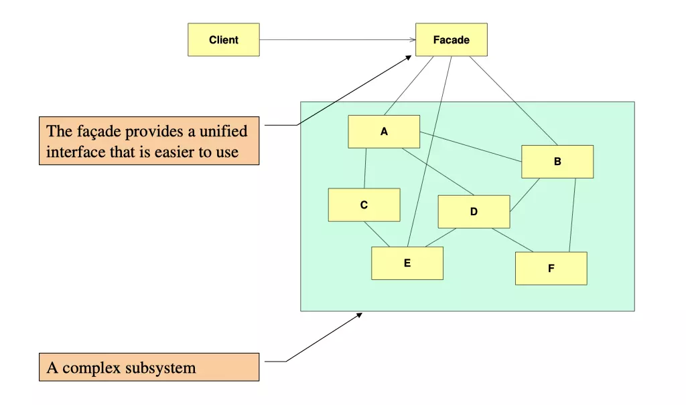

## 外观模式（Facade）

### 定义
外观模式提供了一个统一的（简单）接口，用来访问子
系统中的一群接口。外观定义了一个高层接口，让系统更
容易使用。

### 设计原则

- 针对接口编程，而不是针对实现编程
- 多用组合，少用继承
- 为交互对象之间的松耦合而努力
- 类应该对拓展开放，而对修改关闭 （开放-关闭原则）
- 依赖抽象，而不依赖具体类 （依赖倒置原则）
- "最少知识原则"——只和你的朋友交谈，不要让太多的类耦合在一起。

#### 最少知识原则：定义

在设计系统中，不管是任何对象，都需要注意它所交互的类有哪些，并注意这些类是怎么交互的。

最少知识原则希望，在设计系统的过程中，不要让太多的类交杂在一起，免得修改系统中的一部分，
需要修改其他的部分。如果许多部分相互耦合，系统将会变得复杂、脆弱且不易于维护。

#### 最少知识原则：如何遵循？

设计系统的过程中，就任何对象而言，在对象的方法内，应该只调用属于一下范畴的方法：

1. 对象本身的方法
2. 被当作方法参数而传递进来的对象的方法
3. 方法内创建或实例化的对象的方法
4. 对象的任何组件（域、field）的方法

> 不要调用从上述方法中返回的对象支持的方法。

请看如下例：

```java
public float getTemp(){
    Thermometer thermometer = station.getThermometer();
    return thermometer.getTemperature();
}
```
应该优化为：

```java
public float getTemp(){
    return  station.getTemperature();
}
```
而`getTemperature`方法由`station`域提供。这样做的好处是，我们
不需要认识`Thermometer`对象了。让我们始终保持最小的朋友圈！

#### 最少知识原则：缺点

是的，任何事情都是两面。最少知识原则使得系统耦合度降低，减轻了维护成本，
但同时禁止调用中间对象的方法，这不得不让我们制造更多的"包装"类来处理和
其他组件之间的沟通，这可能会导致开发难度增加。

让我们接着回到『外观模式』吧。

### UML简图



### 要点

1. 外观模式中的`Facade`就是那个"密友"，它封装了其他要用到的方法，满足了最少知识原则。
2. 当要简化并统一一堆接口时，可以使用外观模式。
3. 外观将客户从一个复杂的系统中解耦。
4. 实现外观，需要将子系统组合进外观中，然后将具体的工作委托给子系统执行。
5. 一个复杂的子系统，可以有多个外观。

### 话外

感觉外观模式有点类似于命令模式的`宏命令`，都是通过接口组合抽取特定的行为组成
符合需求的逻辑，供客户调用。

不过，外观模式和命令模式的主要诉求不同：
- 命令模式的诉求是将对接口的请求封装成对象，以便于参数化，甚至于结合队列来使用。
- 外观模式的诉求是从一堆可以满足需求的接口中简化逻辑和依赖，简化开发。
- 至于撤销操作，当然也可以通过外观模式来封装。